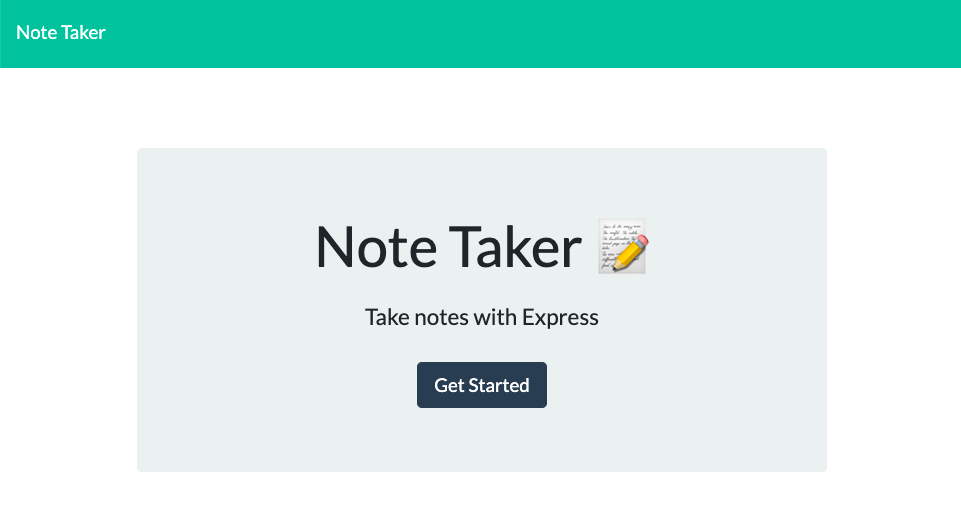
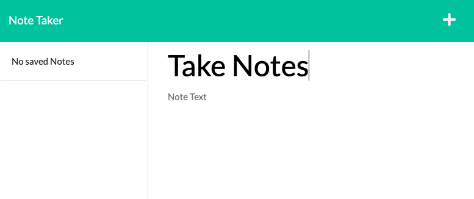
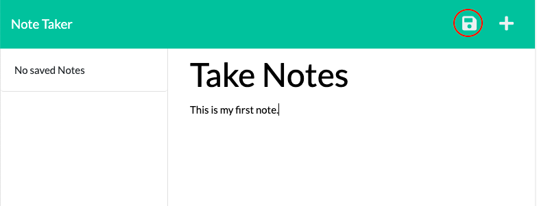
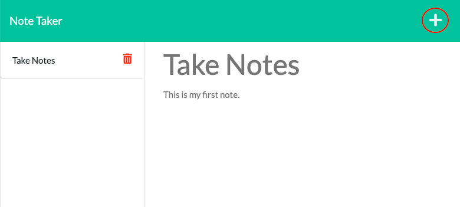
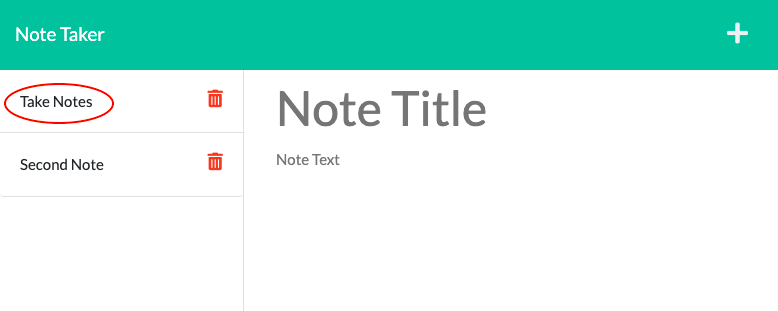
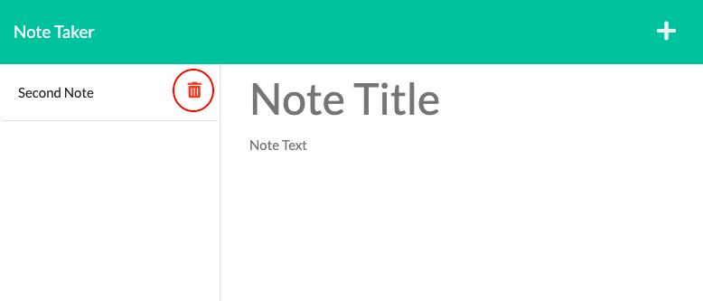

# Kantan Note
[](https://opensource.org/licenses/MIT)

## Description
Easily take notes whenever and wherever you like! You can save them to view the notes later when necessary 😉 </br>
Click [here](https://desolate-caverns-88267.herokuapp.com/) to start taking notes!


## Table of Contents
- [Installation](#installation)
- [Usage](#usage)
- [License](#license)
- [Questions](#questions)

## Installation
1. install node
2. ```cd
    npm i
   ````

## Usage
- Click `Get Started` button to go to note taking page.
- Enter texts by clicking the `Note Title` box and `Note Text` box.

- Save the note by clicking save button.
    - Save button will appear when the both note title and text is entered.

- Add a new note by clicking `+` mark.

- View notes by clicking them.

- Delete a note by clicking delete button next to its title.


## License
Licensed under the [MIT License](https://opensource.org/licenses/MIT).

## Questions
- GitHub Profile: https://github.com/YuriI92
- If you have any additional questions, please feel free to contact me by email.
  E-mail Address: <yurichikawa1992@gmail.com>
      
  